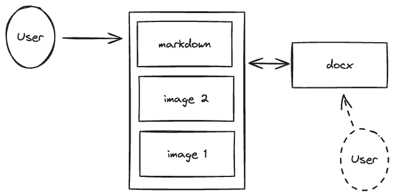

This experiments checks to what extent we could use docx as a self-contained storage format for markdown + media, whilst allowing for a limited amount of editing directly to the docx as well.

# First H1 heading

An often-used Markdown convention is to have a single H1 header per document, and to treat that as the document title.

However, in converting to docx, pandoc treats H1 as just another heading, and prefers to use the title in the yaml header above as the document title.

# How to use this

Convert from markdown to docx:

```shell
# the lua filter will add the codeblock language
# as part of a special prepended line
pandoc README.md -o README.docx --lua-filter md_to_docx_filter.lua
```

Convert that docx back to markdown:

```shell
# this lua filter reads the stored codeblock languages
# and reconstructs the language-labelled codeblocks
# --standalone is to reconstruct yaml
# --extract-media=. required to etract images into ./media/
pandoc README.docx -o README-from-docx.md --lua-filter docx_to_md_filter.lua \
--standalone --extract-media=.
```

# Some tests

## First H2 heading with codeblock

What would happen if I round-tripped this codeblock to docx and back?

```python
def main():
    print("hello world")
```

The python tag gets lost in the docx it seems.

One way of fixing this is by using filters to embed the language in the docx codeblock text, and then to use that language when converting back to markdown.

## Can we also do math?

The equation for finding the roots of a parabolic equation, which is a quadratic equation of the form $ax^2 + bx + c = 0$, is given by the quadratic formula:

$$x = \frac{-b \pm \sqrt{b^2 - 4ac}}{2a}$$

Why yes of course that works pretty well also.

## Links to other files

Link to another file in this directory. What to do?

[the other file](./other_file.docx)

## Finally, a figure


